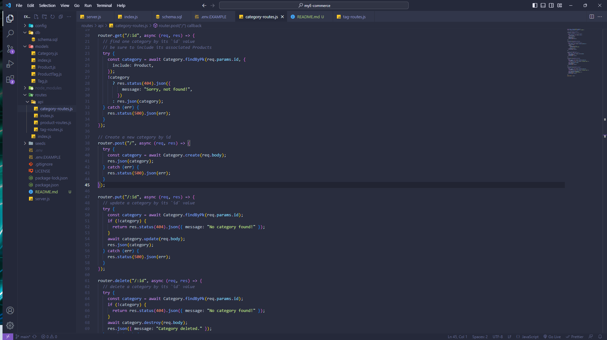
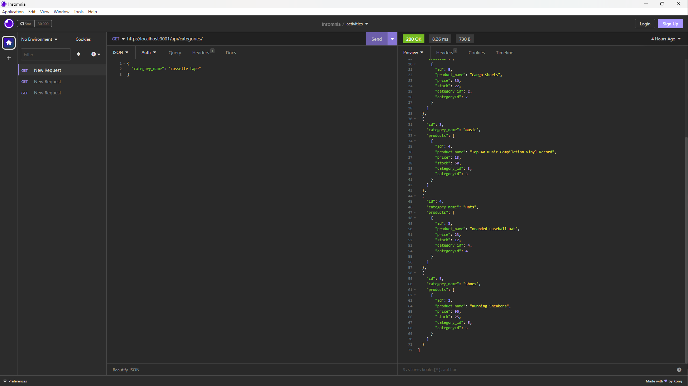
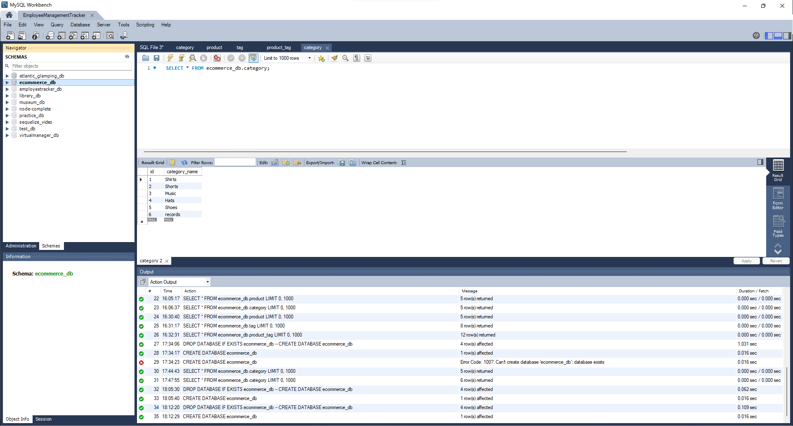

# My E-commerce

## Table of Contents

- [Description](#description)
- [User Story](#user-story)
- [Acceptance Criteria](#acceptance-criteria)
- [Installation](#installation)
- [Usage](#usage)
- [License](#license)

## Description

This project provides a fully functional Express.js API that seamlessly interacts with a MySQL database using Sequelize. By configuring database credentials in an environment variable file, users can establish a connection. Running schema and seed commands creates and populates a development database with test data. Initiating the application command starts the server and synchronizes Sequelize models with the MySQL database. Through API GET routes in tools like Insomnia Core, formatted JSON data for categories, products, and tags is displayed. The project also enables successful data manipulation via API POST, PUT, and DELETE routes in Insomnia Core, enhancing database management capabilities.

## User Story

As a manager at an internet retail company, I aspire to have a technologically advanced back end solution for our e-commerce website. I recognize that staying current with the latest technologies is essential to ensure our company's competitiveness within the market. I envision a seamless integration of modern tools and practices to facilitate streamlined operations and an exceptional user experience for our customers.

## Acceptance Criteria

To fulfill the vision outlined in the user story, the following criteria have been defined:

A functional Express.js API must be developed.
The database name, MySQL username, and MySQL password should be specified in an environment variable file for secure database connections using Sequelize.
Running the schema and seed commands will create a development database preloaded with representative test data.
Starting the application with the appropriate command will initiate the Express.js server, with Sequelize models syncing to the MySQL database.
Upon utilizing API GET routes in Insomnia Core for categories, products, or tags, formatted JSON data will be displayed.
Comprehensive testing of API POST, PUT, and DELETE routes in Insomnia Core will verify successful data creation, updating, and deletion in the database.

## Screenshots

## Installation

Follow these steps to install and run the E-Commerce Back End project:

1. Clone this repository to your local machine.

2. Navigate to the project directory in your terminal.

3. Run npm install to install the required dependencies.

4. Create a .env file and provide your database name, MySQL username, and MySQL password in the specified format:

- DB_NAME=your_database_name
- DB_USER=your_mysql_username
- DB_PASSWORD=your_mysql_password

5. Execute the schema.sql file in your MySQL database to set up the necessary database structure.

6. Seed the development database with test data by running npm run seed.

7. Initiate the Express.js server by running npm start.

## Usage

Once the server is running, use tools such as Insomnia or Postman to test the API routes. The available routes enable the management of categories, products, and tags, allowing you to perform actions like data creation, updates, and deletions via the API.

## License

This project is licensed under the MIT License.
